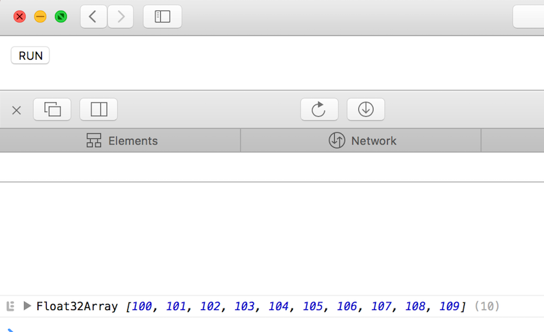

0. [Architecture of Graph Transpiler and How to Extend](../section0)
1. [Elementwise Operator without Parameters](../section1)
2. [Elementwise Operator with Parameters](../section2)
3. **Layer with Weights**

---

# 3. Layer with Weights

In this section, you will learn about how to convert **custom keras layer which has trainable weights**.
 

## Example: Bias

In section 1 and section 2, we learned how to convert operators which have no weights. 

In this section, we'll consider `BiasLayer` defined as follows:

```python
class BiasLayer(keras.layers.Layer):
    """
    Trainable bias layer

    # Input shape
        2D tensor of shape `(num_samples, features)`.

    # Output shape
        2D tensor of shape `(num_samples, features)`.
    """

    def build(self, input_shape):
        self.bias = self.add_weight(name='bias',
                                    shape=(input_shape[-1],),
                                    initializer=keras.initializers.get("uniform"))

    def call(self, x):
        return x + self.bias
```

This layer has a trainable weight named `"bias"`.


## Axis and Order

To define variables and operations' semantics, `Axis` and `Order` object is defined in WebDNN.

### Axis

`Axis` object represents each dimension of tensors. Typical axes are pre-defined like follows:

```python
Axis.N  # batch size
Axis.C  # number of features
Axis.H	# height of image
Axis.W	# width of image
Axis.T	# length of series
```

For example, a tensor of shape `(batch_size, features)` is 2D tensor. This tensor's first dimension is represented as `Axis.N`, and second dimension is represented as `Axis.C` in WebDNN.

Also, `Axis` object is used to define operation. For example `Softmax` operator is compute normalized exponential values. Generally, that values are normalized along to `Axis.C`.

### Order

`Order` object represents the data order of variables. For example, the data order of a tensor of shape `(batch_size, features)` is `OrderNC`.

WebDNN's operators are designed to receive various data order. For example, generally `Softmax` operator is used to normalize `OrderNC` variable along to `Axis.C` and the output is also `OrderNC` variable. However WebDNN's `Softmax` operator can receives `OrderCN` variable too.

Typical order is defined in `webdnn.graph.order`

## Define Converter Handler

Based on previous section, Let's convert `BiasLayer`.

Luckily, bias operator is already implemented in webdnn as `ElementwiseAdd`, or operator `+`. 
Therefore, you only have to implement converter handler.

Converter handler is implemented like follows: 

```python
from webdnn.frontend.keras.converter import KerasConverter
    
@KerasConverter.register_handler("BiasLayer")
def square_converter_handler(converter, keras_layer):
    keras_x = converter.get_input_tensor(keras_layer)[0]
    webdnn_x = converter.get_variable(keras_x)
    
    webdnn_b = converter.convert_to_constant_variable(keras_layer.bias, OrderC)

    webdnn_y = webdnn_x + webdnn_b
    keras_y = converter.get_output_tensor(keras_layer)[0]

    converter.set_variable(keras_y, webdnn_y)
```

The important lines are follows:

```python
webdnn_b = converter.convert_to_constant_variable(keras_layer.bias, OrderC)
```

`converter.convert_to_constant_variable(weight, order)` is the function which converts keras weights into WebDNN variables. 
The output variables' data order is determined by `order`. 
In `BiasLayer`'s case, `bias` is a tensor of shape `(features,)`. Therefore `order=OrderC` is specified.

Different from `webdnn_x` and `webdnn_y`, it's not need to store `webdnn_b` variable into converter 
because `keras_layer.bias` is not referenced from other keras layers.


## Test

Let's test the implementation.

```python
# test.py

import bias
import keras
import numpy as np
from webdnn.backend.fallback.generator import FallbackDescriptorGenerator
from webdnn.backend.webassembly.generator import WebassemblyDescriptorGenerator
from webdnn.backend.webgpu.generator import WebGPUDescriptorGenerator
from webdnn.frontend.keras.converter import KerasConverter

# Define Keras model
x = keras.layers.Input((10,))
layer = bias.BiasLayer()
y = layer(x)
model = keras.models.Model([x], [y])

# For test, initialize bias by 100.
keras.backend.set_value(layer.bias, np.ones(layer.bias.shape) * 100)

# Convert Keras model into WebDNN graph IR
graph = KerasConverter(batch_size=1).convert(model)

# Generate graph descriptor
WebGPUDescriptorGenerator.generate(graph).save("./output")
WebassemblyDescriptorGenerator.generate(graph).save("./output")
FallbackDescriptorGenerator.generate(graph).save("./output")
```

```html
<!--index.html-->

<button onclick="main()">RUN</button>
<script src="../../../dist/webdnn.js"></script>
<script type="application/javascript">
    async function main() {
        let runner = await WebDNN.load("./output");
        let x = runner.getInputViews()[0];
        let y = runner.getOutputViews()[0];
    
        x.set([0, 1, 2, 3, 4, 5, 6, 7, 8, 9]);
    
        await runner.run();
    
        console.log(y.toActual());
    }
</script>
```

The result is like follows.



---

- [Prev: "2. Elementwise Operator with Parameters"](../section2)
